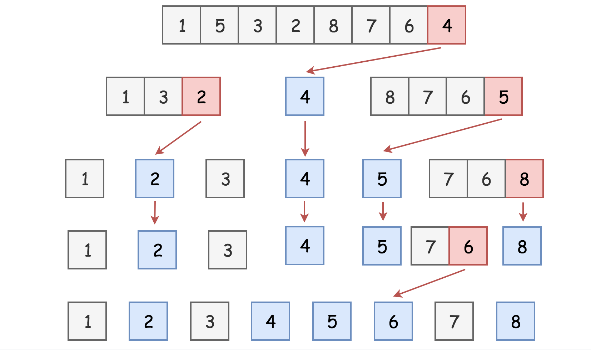

# Quicksort - Быстрая сортировка

- Алгоритм неустойчивой сортировки.
- Алгоритм "разделяй и властвуй".

## Сложность алгоритма

- Time complexity.
  - В худшем случае: `O(n^2)`.
  - В среднем (он же лучший случай): `O(n*log(n))`.
- Space complexity: `O(log(n))`.

## Шаги алгоритма

1. Выбрать элемент, называемый **опорным**.
   - Он может быть любым, но от его выбора зависит скорость алгоритма.
   - Лучше брать случайный элемент.
2. Найти элементы, меньшие опорного, и элементы, большие опорного.
   - Этот процесс называется **разделением**.
3. Применить алгоритм быстрой сортировки к обоим подмассивам.
4. Объединить результаты:
   - Подмассив с меньшими элементами + опорный элемент + подмассив с большими элементами.

## Особенности выбора опорного элемента

1. Худший случай - когда каждый раз берётся наименьший элемент.
   - Тогда "левый" массив будет пустой, а все элементы будут в "правом".
   - Аналогично наоборот.
   - Высота стека вызовов будет `O(n)`.
2. Лучший случай - когда каждый раз берётся средний по значению элемент.
   - Тогда массив будет делиться пополам и стек вызовов будет короче (понадобится меньше итераций).
   - Высота стека вызовов будет `O(log(n))`.

## Область использования

- Крупные массивы без большого количества дубликатов.
- Параллельная сортировка.

## Пример

